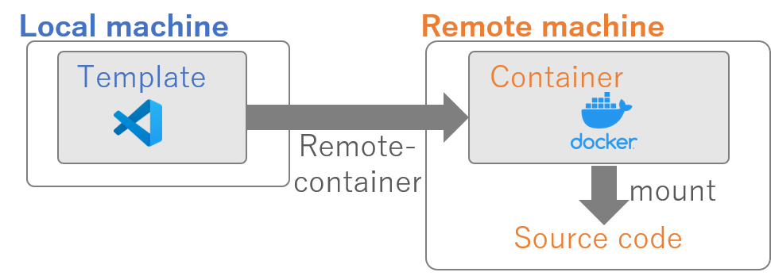

# Remore container templates with VScode
Templates for some docker configurations with vscode remote containers.

Our typical use case is to launch a container running on a remote host while using vscode locally to esit the source code in the host machine.
The templates is configured to mount a remote local folder in the remote host machine.



## Requirement

* Visual Studio Code
* Visual Studio Code extensions:
  * Remote - Containers
* Docker Desktop 2.0+
  * (For Windows, WSL2 backend) 

## How to use

### Step 1: Choose a template project
* Choose one of the template projects and open the folder in vscode.

### Step 2: Configure a remote host
Create a setting file in a template project, `.vscode/settings.json`, and specify your remote machine:

Example:
```json
{
    "docker.host": "ssh://user@192.168.1.x:22"
}
```

### Step 3: Configure docker-compose file's volume setting
We make a remote host's folder accessible from the container.
Open `.devcontainer/docker-compose.development.yml`, and configure your remote machine's folder:

Example:
```yml
{
    volumes:
      - /your/host/machine's/folder:/workspace:cached
}
```

This mounts `/your/host/machine's/folder` in the remote host machine to `/workspace` in the container.

### Step 4: Build and Open the container

In vscode, Press `F1` and chooe `Remote-Containers: Rebuild and Reopen in Container`
